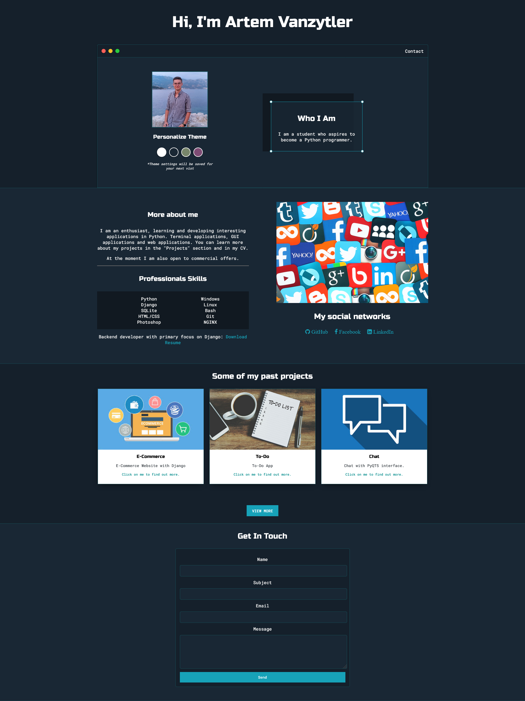

# Portfolio</br>

I wrote this site to supplement my resume. Each project (Technologies, features, description, github link and photo) can be viewed on it. And there is also a feedback form.</br>


# Download & Setup Instructions :
* Clone the project. This will download the GitHub respository files onto your local machine.</br>
```Shell
git clone https://github.com/teredet/Portfolio
```
* Create a virtual environment and activate
```Shell
    pip install virtualenv
    python -m virtualenv envname
    envname\scripts\activate
```
* Install requirements
```Shell
    cd Portfolio
    pip install -r requirements.txt
```
* Create file with secret keys:
```Shell
    Create a file "secretkey.py" and add fields:
    'SECRET_KEY' - secret key for Django project (you can use this command: 'python manage.py generate_secret_key'), 
    'LOGIN' - your mail box, 
    'PASSWORD' - pass for your mail box.
```
* Run program
```Shell
    python manage.py runserver
```

# Features
* Ability to download a resume from the site
* Change the theme that is saved across all pages
* Block with 3 best projects
* Page with all projects
* A page for each project with a link to the github, description, stack, features and screenshots of the main pages.
* Feedback via mail 

# Tech Stack
* Python
* Django
* Pillow
* SQLite

# Main page


# Projects page


# E-Commerce project page
